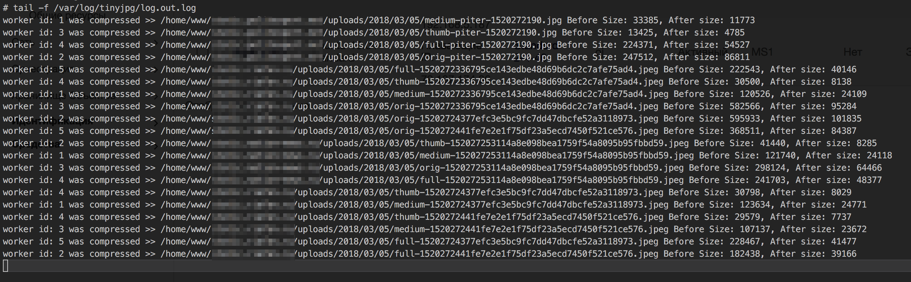

# TinyJPG Filesystem watcher and image compress
[](https://goreportcard.com/report/github.com/OrlovEvgeny/TinyJPG?)
[](https://travis-ci.org/OrlovEvgeny/TinyJPG)

JPEG image compress watcher based Filesystem event notification [github.com/rjeczalik/notify](https://github.com/rjeczalik/notify)




## Install binary

**Installation dependency**
```bash
~ $ apt install libmagickwand-dev imagemagick
```

for **amd64**
````bash
~ $ curl -L https://github.com/OrlovEvgeny/TinyJPG/releases/download/v0.0.7-beta/tinyjpg-amd64 --output /usr/local/bin/tinyjpg
````
 or **i386**
````bash
~ $ curl -L https://github.com/OrlovEvgeny/TinyJPG/releases/download/v0.0.7-beta/tinyjpg-386 --output /usr/local/bin/tinyjpg
````

**permission for execution**
````bash
~ $ chmod +x /usr/local/bin/tinyjpg
````

**check that everything is fine**
````bash
~ $ tinyjpg -help

   Usage of tinyjpg:
  -path string
    	uploads folder path, default - /home/www (default "/home/www")
  -verbose
    	verbose log (default true)
  -worker int
    	maximum amount workers (default 5)

````

## Use
**I recommend using [supervisor](http://blog.questionable.services/article/running-go-applications-in-the-background/)**

*example config*
```bash
~ $ vim /etc/supervisor/conf.d/tinyjpg.conf
```
*write*
```bash
[program:tinyjpg]
command=/usr/local/bin/tinyjpg -path=/home/www/example.com/images -verbose=true -worker=10
environment=ENVIRONMENT=production
autorestart=true
user=root
redirect_stderr=true
stderr_logfile=/var/log/tinyjpg/log.err.log
stdout_logfile=/var/log/tinyjpg/log.out.log
```

```bash
~ $ mkdir -p /var/log/tinyjpg
```

```bash
~ $ service supervisor restart
```

or use **Tmux**

```bash
~ $ tinyjpg -path=/home/www/example.com/images -verbose=true -worker=10
```

**Args:**
* *path* - required. Path to watch new files, default /home/www
* *verbose* - optional. Verbose log out, default true
* *worker* - optional. Amount start workers process, default 5


## Build Source

**For compilation you need to install [Golang1.8](https://medium.com/@patdhlk/how-to-install-go-1-8-on-ubuntu-16-04-710967aa53c9)**

```bash
~ $ apt install libmagickwand-dev imagemagick
```

```bash
~ $ git clone https://github.com/OrlovEvgeny/TinyJPG && cd TinyJPG
```

```bash
~ $ go get -u github.com/rjeczalik/notify
```

```bash
~ $ mkdir build && go build -o ./build/tinyjpg *.go
```

```bash
~ $ mv /build/tinyjpg  /usr/local/bin/tinyjpg
```
**permission for execution**
````bash
~ $ chmod +x /usr/local/bin/tinyjpg
````
